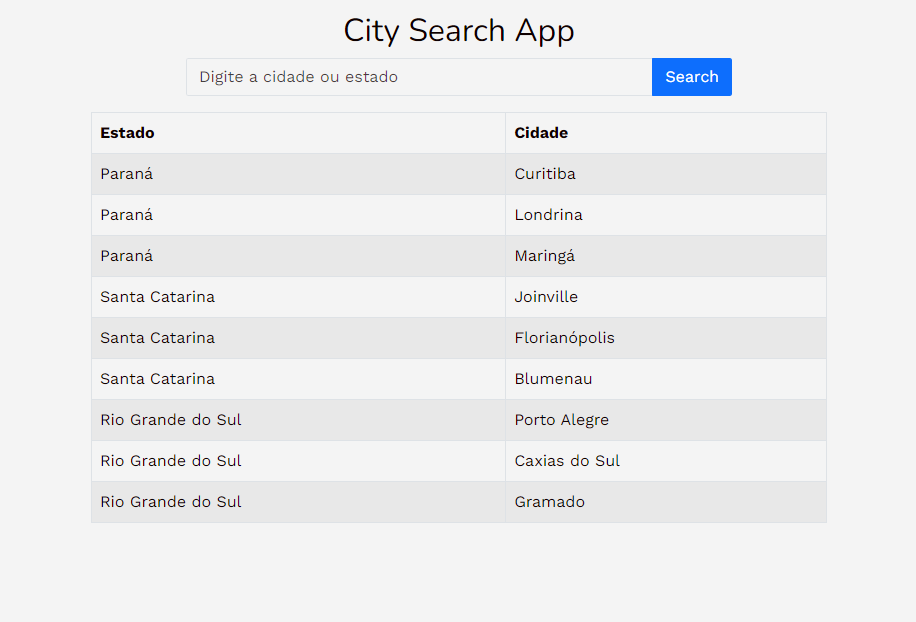
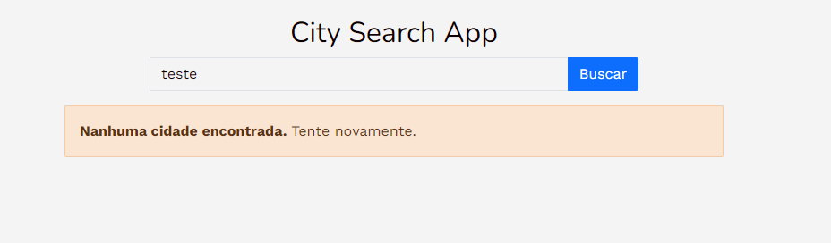
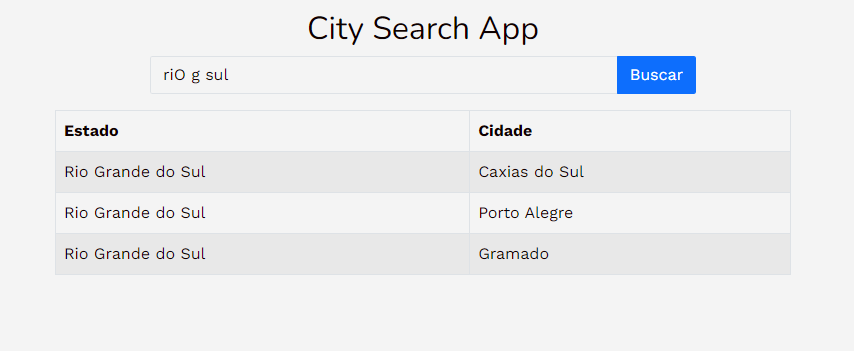
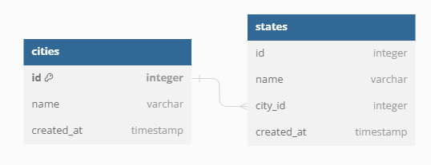

# City Search App

# Sobre o projeto
  City Search App é uma aplicação fullstack de consulta de cidades e estados a partir de um banco de dados já pré-estabelecido.

  A aplicação consisite em retornar as cidades de um estado a partir de uma busca completa ou parcial do nome da cidade ou estado.

## Layout web

## DataBase Schema

# Tecnologias utilizadas

* Rails 5.2.6

* Ruby 2.7.0

* Bootstrap 5.3.1

* Pg_search

* Banco de dados: Postgresql

# Como executar o projeto
